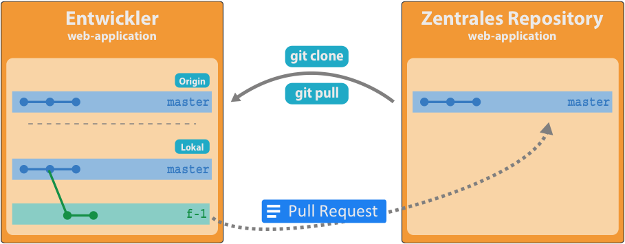
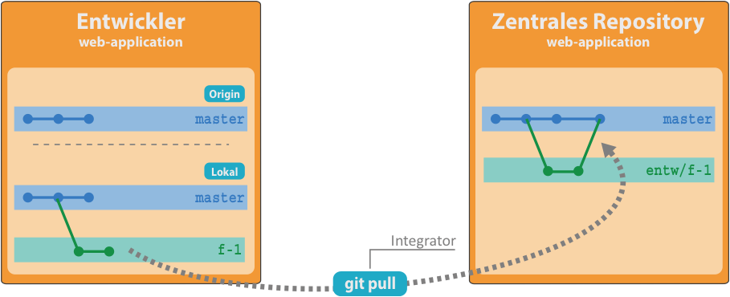

___SECTION_______________________________

  <aside class="notes">
  Wie sind die Repos aufgebaut?
  Wer ist für was verantwortlich?
  </aside>

Struktur
========

_________________________________________

  <aside class="notes">
  Frage-Folie
  </aside>

Big Repo oder viele Repos?
==================================

_________________________________________

  <aside class="notes">
  Ergebnis-Folie
  </aside>

<table cellspacing="15">
  <tr bgcolor="yellow">
    <th>&nbsp;Big Repo</th>
    <th>&nbsp;viele Repos</th>
  </tr>
  <tr>
    <td>
       
       
       
       
       
       
      
    </td>
    <td>
       
       
      
    </td>
  </tr>
  <tr bgcolor="yellow">
    <th>&nbsp;Beides</th>
  </tr>
  </tr>
    <td>
       
      
    </td>
  <tr>
</table>

_________________________________________

  <aside class="notes">
  Fallbeispiel
  </aside>

### Unternehmen: 



## Entscheidung: Repo pro Modul

Es zeigte sich, dass der Verwaltungs- und Koordinationsaufwand für Repos und Branches recht hoch war.

_________________________________________

  <aside class="notes">
  Fallbeispiel
  </aside>

### Unternehmen: 



## Entscheidung (revidiert): 1 Repo

Besser. Release-Vorbereitungen vereinfacht. Es ist klar, was rausgehen soll, und was zu testen ist.

<!-- TODO evtl. C Finanzen -->

_________________________________________

  <aside class="notes">
  Fallbeispiel
  </aside>

### Unternehmen: 



Entscheidung: Repo pro Modul
--------------------------------

 * Separate Release-Planung pro Modul möglich (eigene Branches).
 * Separate Freigaben von Änderungen pro Modul.
 * Historie für die Teams übersichtlicher.

_________________________________________

  <aside class="notes">
  Fallbeispiel

  Problem bei Subtrees: Sehr viel Subtree-Merge-Commits bei jeder täglichen Integration. (> 30 Minuten). Mit read-tree-Lösung (< 2 Minuten).
  </aside>

### Unternehmen: 



Entscheidung (zusätzlich): Globales Repo mit Subtrees
--------------------------------

Übergreifende Historisierung, Nachvollziehbarkeit, globales Release und Revisionssicherheit. Täglich zusammengeführte Basis für alle Entwicklungen.

<!-- TODO evtl. E embedded -->

_________________________________________

  <aside class="notes">
  Frage-Folie

  Diese Frage ist vor allem dann relevant, wenn die Antwort auf die
  vorige Frage "viele Repos" lautet.

  Dann stellt sich dir Frage, wie gewährleistet man einen konsistenten
  Stand, wenn Änderungen mehrerer Module betreffen.
  </aside>

# Abhängigkeits- management

## mit Git (Submodule/Subtree) oder extern (Maven, Gradle & Co.)?

_________________________________________

  <aside class="notes">
  </aside>

Repo-Abhängigkeiten
-------------------

 * Die meisten befragten Unternehmen arbeiten mit externen Abhängigkeiten (Ausnahme D-Versicherung, die teilweise mit Subtrees arbeitet).
   * Davon wiederum nuzten die meisten Maven.
   * Eines nutzt Gradle.
   * Zwei arbeiteten mit Package-Managern.
 * Git Submodule und Subtrees sind komplexer und nicht so flexibel wie externe Werkzeuge.

_________________________________________

  <aside class="notes">
  Frage-Folie
  </aside>

Administration
==============

 * Oft ist nicht viel zu tun. Insbesondere beim Big-Repo-Ansatz
 * Admins richten Repos ein.
 * Dev-Teams verwalten die Feature-Branches.

_________________________________________

  <aside class="notes">
  Frage-Folie
  </aside>

Push oder Pull?
=======================

_________________________________________

  <aside class="notes">
  Frage-Folie
  </aside>

_________________________________________

  <aside class="notes">
  Frage-Folie
  </aside>

_________________________________________

  <aside class="notes">
  Ergebnis-Folie
  </aside>

<table cellspacing="15">
  <tr bgcolor="yellow">
    <th>&nbsp;Push</th>
    <th>&nbsp;Pull-Requests</th>
  </tr>
  <tr>
    <td>
       
       
       
       
       
       
       
      
    </td>
    <td>
       
       
      
    </td>
  </tr>
</table>

_________________________________________

  <aside class="notes">
  Fallbeispiel
  </aside>

### Unternehmen: 



Entscheidung: Pull-Requests
---------------------------

Nicht der Entwickler, sondern Leitung bestimmt, ob und wann etwas übernommen wird.

_________________________________________

  <aside class="notes">
  Fallbeispiel
  </aside>

### Unternehmen: 



## Entscheidung: Pull-Requests

Durch Pull-Requests wird garantiert, dass keine Änderung direkt vom Entwickler ins Hauptrepo wandert. Erst nach einem Code-Review.
